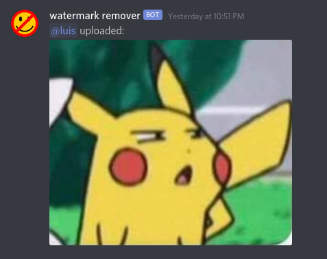
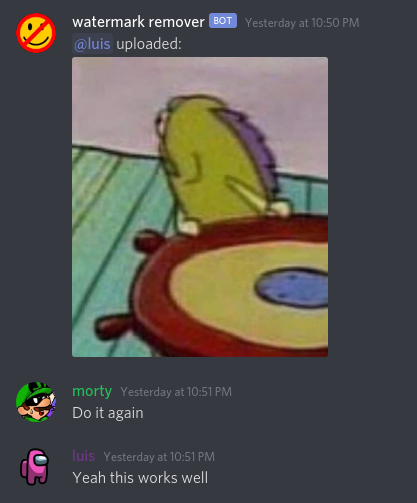
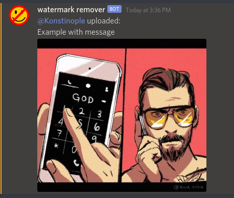

# Watermark Remover Bot

Watermark Remover Bot is a Discord bot that detects and removes easily croppable website watermarks. It automatically scans uploaded images in new posts for watermarks, then deletes + re-uploads the post with the watermark cropped out.

[Click to invite](https://discord.com/oauth2/authorize?client_id=761447220586479647&permissions=43008&scope=bot), currently supports Reddit and ifunny watermarks.

## Testing

Drop images in `tests/files`, sync `tests/test-findWatermarkY.ts` with the types of images you're testing against. `npm test` will run [ava](https://www.npmjs.com/package/ava) on `*.ts` files in `tests/`

## Environment

- `BOT_TOKEN`
  - Required, found in Developer Portal -> \[App Name\] -> Bot -> `Reset Token`
- `DEBUG_CHANNEL`
  - Set to a channel id to restrict the bot to a specific channel for local testing.

## Screenshots

